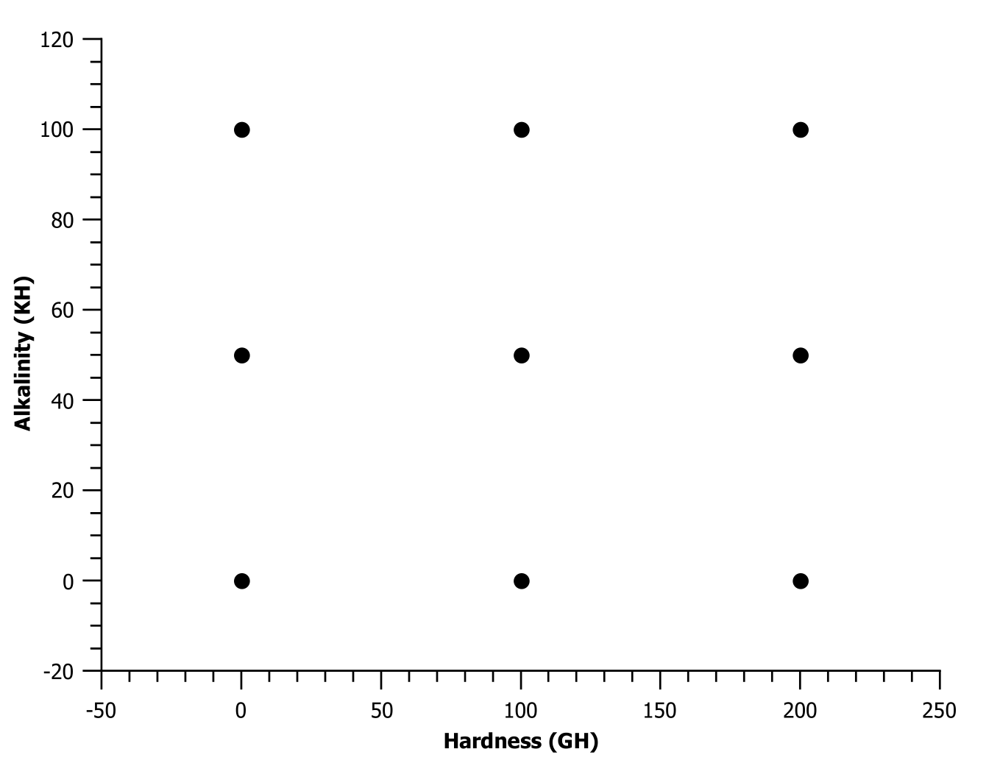
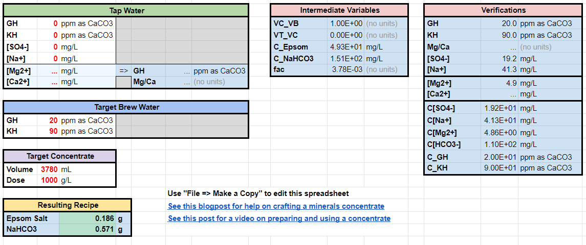
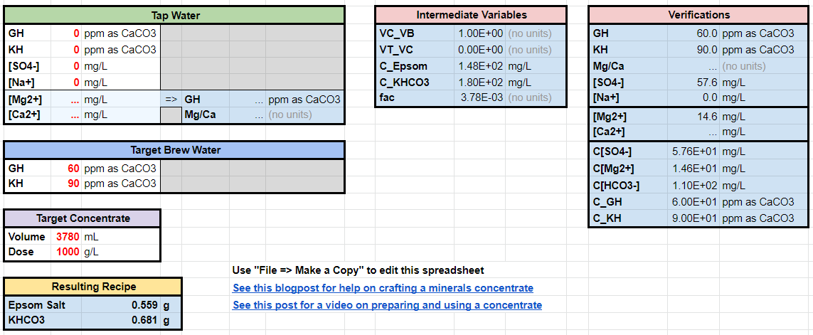
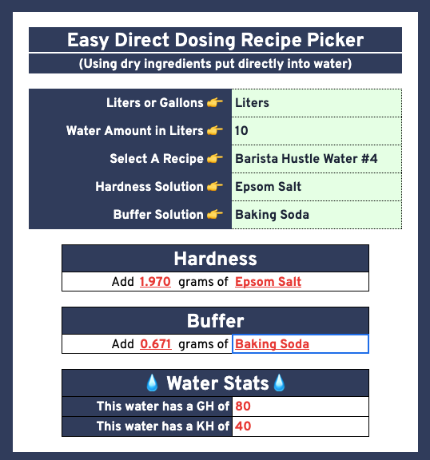
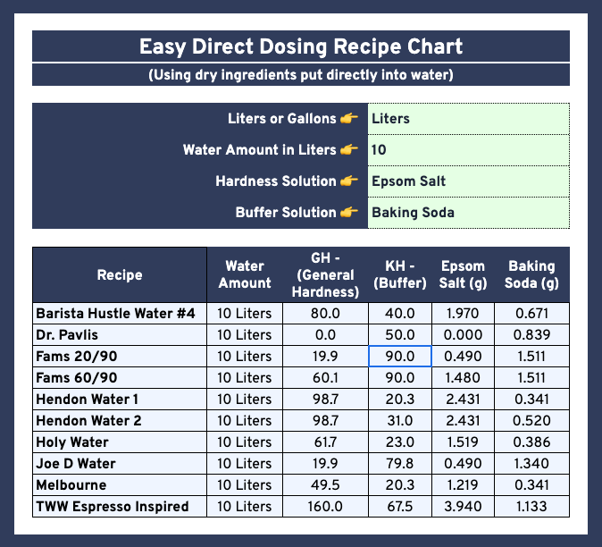
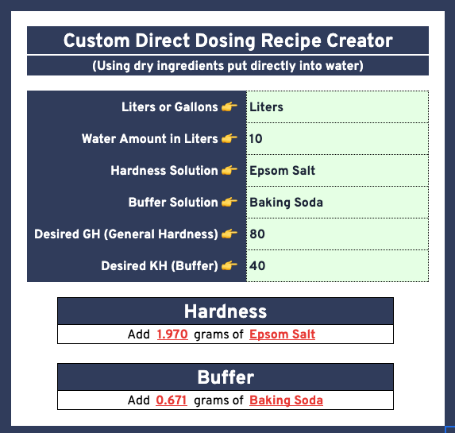
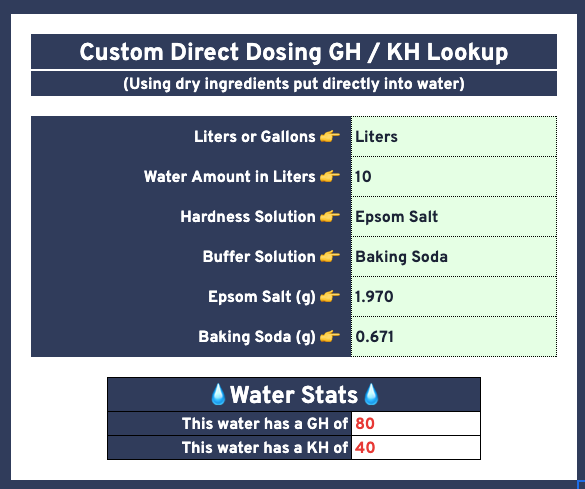

# Intro to Water
## The Importance of Water

Water is the main ingredient in coffee. Using good, clean water is important for making good coffee.
When considering which water to use, there are two main considerations:
1. Safety - this refers to boiler safety and scale buildup, mainly for espresso.
2. Taste - the composition of minerals in water can affect the taste of the final drink and may vary by preparation.


## The Basics - Water Safety
When we refer to water safety, the focus is not on safety for consumption, though obviously you should always make sure that the water you are using is safe to drink.
For coffee making, and particularly for espresso machines, safety refers to the hardness of the water that can cause scale buildup inside espresso machines and boilers. Hard water can also cause scale buildup in kettles or automatic brewers.

Water hardness is a measure of the concentration of calcium and magnesium in the water. As water is heated and cooled, these minerals will deposit inside any surface it comes into contact with (pipes, boilers, kettles) and can eventually clog or damage these if not properly treated.
Water hardness is typically measured in ppm (parts per million) of calcium and magnesium.

<ins>As a general guideline, aim for ~50ppm hardness in your water, with >100ppm considered hard and not recommended for use in espresso machines<ins>

While the typical concern is water being too hard, water with too few minerals (very low ppm or distiller water) is not safe to use either, as it may leech metals, depending on your boiler material.

### How do I measure my water hardness?
In some areas, municipal water supplies post regular water reports which can be found by googling "town name water report". The key factors to look for are general hardness (GH) and alkalinity (KH). In the United States, this is often reported as parts per million (aka mg/L of CaCO<sub>3</sub> equivalent). Keep in mind that these reports are not always accurate or up to date, but can be a good starting point  - <ins>if your municipality reports high levels of hardness you should consider filtering or making your own water<ins> (more on water recipes below).

You can also measure your water using two fairly inexpensive methods:
1. An electronic TDS (total dissolved solids) meter
2. A water test kit that includes hardness strips

TDS meters measure the conductivity of your water and report the total ppm in the water. This measures all dissolved solids in the water, not just magnesium and calcium, but can give a general direction of hardness - <ins>if your total ppm is between 50 and 100 you're likely ok<ins>

Water test kits are available from espresso machine makers such as La Marzocco and will have test strips specifically for hardness minerals. The tests themselves will not be as specific as TDS measurement but can give a general sense of hardness minerals in your water


### What do I do if my water is hard?
There are several options when considering water treatment / replacement:
1. Water filters
2. Store-bought mineral water
3. Coffee water mineral packets
4. Custom water recipes

Water filters can help reduce water hardness as well as improve overall water quality for flavor. There is a wide range of water filters, from pitchers such as ZeroWater all the way to plumbed in filtration systems. Keep in mind that if you use a total filtration system, like ZeroWater or Reverse Osmosis (RO), you should add minerals to your water post-filtration, as fully distilled water will both taste bad and may be harmful for your espresso machine.

Some machine manufacturers recommend specific mineral water [brands](https://home.lamarzoccousa.com/water-for-home-espresso-machines/). Generally speaking it is hard to know the exact composition of minerals for different brands, but if your water is particularly hard, this may be a safer option.

Mineral packets / droppers are now widely available to remineralize RO water or distilled water.
Companies such as [TWW](https://thirdwavewater.com/) and [Lotus](https://lotuscoffeeproducts.com/) offer products with specific mineral content for different brewing technique.

Lastly, many aficionados like to make their own water, starting with RO or distilled water as a base and adding a specific mixture of minerals for their taste and brewing methods.

Continue reading below for a more advanced section on how to make your own water and current popular recipes.


# Advanced - Making Your Own Water
## The Simple Water Recipe

A longtime Espresso enthusiast, Dr. Pavlis, simplified the recipe as follows: 50-100mg/L of Potassium or Sodium Bicarbonate. This water is scale free when used in an espresso machine prevents the need for regular descaling. A simple way to utilize this ratio is as follows:

<ins>Ingredients</ins>

4L Distilled or Deionized water

0.35g Potassium Bicarbonate

<ins>Method</ins>
1. Put the Potassium Bicarbonate into the water
2. Agitate
3. Let rest for 5-10 mins (This ensures sufficient time for the Potassium Bicarbonate to properly dissolve into the water)

That's it. Really.


### The Why

The premise here is that the water acts simply as a carrier for the compounds you are trying to extract from your beans. We start with distilled or de-ionized water as a base because these have little to no TDS (a measure of the amount of dissolved particles of other substances are in the water). In order to neutralize the corrosive effect this will have on your machine, and to improve the extraction of desirable coffee compounds, Dr. Pavlis settled on the use of Potassium (or Sodium) Bicarbonate. In this application the bicarbonate acts as a "buffer", bringing the pH of the distilled water closer to 7 (neutral pH) while also raising TDS a little bit.


### The "But my scale won't measure that accurately"

A shortcoming of the recipe provided above is the difficulty of consistently measuring 0.35g of the buffer. So, yet more perfection and simplification seeking enthusiasts reached the conclusion that a concentrate of buffer can be used to simplify the measurements needed.

To make a 10,000x ppm concentrate, mix 20g of Potassium Bicarbonate into 1L of distilled water.

To use the concentrate, start with 5mL of concentrate and add water to a total volume of 1L. To make 4L of water, start with 20mL of concentrate and add water to a total volume of 4L.


## The More

Some espresso enthusiasts have found the "Pavlis Water" recipe is lacking a component. The thought here is that calcium or magnesium (commonly considered "hardness" minerals), in carefully controlled doses, allow a better extraction. I will stop short of making any qualitative judgement between this approach and the one outlined above.
Since there are myriad ways to introduce hardness chemicals into your water, we'll continue to add water resources here on the wiki.


# Water 2: A Practical Guide of Understanding Water for Dialing in Coffee
_by azeotropes, chill'd, and sagebush_

_TLDR:_

If RPavlis water mentioned in the beginning water entry has a somewhat weird taste, try these other recipes. My current favorite for espresso is the TWW Espresso Inspired.

Epsom Salt = MgSO<sub>4</sub>·7H<sub>2</sub>O<br>
Baking Soda = NaHCO<sub>3</sub><br>
Potassium Bicarbonate = KHCO<sub>3</sub>


## Direct dosing
The method I am proposing is to direct dose into the final container without any concentrates. You add these amounts, and then fill the water to the proper volume. Scale up or down as needed. 10 L is used for easy measurements using 0.1 g accurate scales. For smaller measurement, jewelry scale that goes to 0.001 could be used. AWasteOfCoffee recommended [these](https://www.amazon.com/dp/B011J88S8M/ref=cm_sw_r_cp_apan_glt_fabc_1GFN17ASKK0BN4KCY9K8?_encoding=UTF8&psc=1), and I got them. Concentrates could also be used if your scale does not weigh fine enough. If only a 0.1g scale is on hand, then I recommend starting with RPavlis as a forgiving water recipe. (0.38g Potassium Bicarbonate to 1 gallon of water). Aim for 0.4 to 0.5 grams.


Name | Volume | Epsom Salt (g) | Baking Soda (g) | Potassium Bicarbonate (g) | GH (mg/L of CaCO<sub>3</sub> equiv.) | KH (mg/L of CaCO<sub>3</sub> equiv.) | Comments
------------ | -------------|------------ | -------------| -------------| -------------| -------------| -------------
“Holy” Water|10 Liter| 1.520 | 0.000 | 0.460 | 62 | 23 | Targeted towards Filter
" |1 Gallon| 0.575 | 0.000 | 0.174 | 62 | 23 | "
Melbourne Water|10 Liter | 1.220 | 0.340 | 0.000 | 49.5 | 20.2 | General Purpose Water for Both
" |1 Gallon | 0.461 | 0.129 | 0.000 | 49.5 | 20.2 | "
Hendon Water |10 Liter | 2.430 | 0.520 | 0.000 | 99 | 31 | Targeted towards Espresso
"|1 Gallon | 0.922 | 0.197 | 0.000 | 99 | 31 | "
Barista Hustle Water #4|10 Liter | 1.970 | 0.671 | 0.000 | 80 | 40 | General Purpose Water for Both
"|1 Gallon | 0.745 | 0.254 | 0.000 | 80 | 40 | "
TWW Espresso Inspired|10 Liter | 3.940 | 0.000 | 1.350 | 160 | 67.5 | Targeted towards Espresso
"|1 Gallon | 1.489 | 0.000 | 0.510 | 160 | 67.5 | "
RPavlis|10 Liter | 0.000 | 0.000 | 1.000 | 0 | 50 | Targeted towards Espresso
"|1 Gallon | 0.000 | 0.000 | 0.378 | 0 | 50 | "
Fam's 29th Wave|10 Liter | 0.493 | 1.511 | 0.000 | 20 | 90 | Targeted towards Light Roast Espresso
"|1 Gallon | 0.186 | 0.571 | 0.000 | 20 | 90 | "
Fam's 69th Wave|10 Liter | 1.478 | 1.511 | 0.000 | 60 | 90 | Targeted towards Light Roast Espresso
"|1 Gallon | 0.559 | 0.571 | 0.000 | 60 | 90 | "

[Use Spreadsheet Calculators here to look up the above or craft your own waters!](#spreadsheet-calculators)

[Read Detailed Explanations here](#explanations-of-waters-in-the-water-recipe-table)

* Fam's recipe above has been modified for easier use from Potassium Bicarbonate to Baking Soda. According to Sagebush "Baking Soda smoothes out the brightness quiet a bit. Potassium is more flavour transparent but adds a distinct metallic taste." Use the factors below to switch back to using Potassium Bicarbonate if desired.

### Conversion of Baking Soda vs Potassium Bicarbonate
The use of Baking Soda and Potassium Bicarbonate for this purpose is for alkalinity. To switch between one value to another is simply multiplying it by a factor. The molecular weight of Baking Soda is 84 g/mol. The molecular weight of Potassium Bicarbonate is 100 g/mol.

Baking Soda -> Potassium Bicarbonate = (weight you wish to convert) * (mw of Potassium Bicarbonate / mw of Baking Soda) = (weight) * 100/84

Potassium Bicarbonate -> Baking Soda = (weight you wish to convert) * (mw of Baking Soda / mw of Potassium Bicarbonate) = (weight) * 84/100

#### Example #1 Converting Barista Hustle #4 1 Gallon from Baking Soda to Potassium Bicarbonate

Weight required with Baking Soda: 0.254 g.

0.254 g * 100/84 = 0.302 g Potassium Bicarbonate

#### Example #2 Converting RPavlis Water 1 Gallon from Potassium Bicarbonate to Baking Soda

Weight required with Potassium Bicarbonate: 0.378 g.

0.378 g * 84/100 = 0.317 g Baking Soda


## Using Concentrates
An alternative to direct dosing is to pre-mix concentrates, and use those for your recipes. Using 1,000 or 10,000 ppm concentrates makes trying new water recipes easy.

For example, to make RPavlis 0/50 (GH/KH) water, take 5g of 10,000x KH concentrate and add water up to a total volume of 1L. Holy water (62/23) can be made by adding 6.2g of 10,000x GH concentrate to 2.3g of 10,000x KH concentrate and adding water to a total volume of 1L.

If scale precision is an issue, 1,000 ppm concentrates can be made by diluting 100ml of 10,000x concentration with water to a total volume of 1L.


### GH (aka General Hardness) Concentrates:

Compound | Mass (g) | Water volume (mL) | Concentration (mg/L of CaCO<sub>3</sub> equiv.)
-------- | -------- | ------------------ | --------------------
Magnesium Sulphate Heptahydrate (Epsom Salt) | 24.63 | 1,000 | 10,000
Magnesium Chloride Dihydrate | 13.11 | 1,000 | 10,000
Magnesium Chloride Hexahydrate | 20.31 | 1,000 | 10,000
Calcium Chloride Dihydrate | 14.69 | 1,000 | 10,000
Calcium Sulphate Dihydrate (Gypsum)* | 17.20 | 1,000 | 10,000
Calcium Hydroxide | 7.40 | 1,000 | 10,000

\* Note: Only around 3.6g of gypsum will fully dissolve in 1,000 mL of water at room temperature. This means the highest concentration, fully dissolved gypsum concenrate you can make is around 2,092 mg/L of CaCO<sub>3</sub> equiv. 1.72g of gypsum in 1,000 mL of water would make a safely dissolved solution with concentration of about 1000 mg/L of CaCO<sub>3</sub> equiv.

### KH (aka Carbonate Hardness aka Buffering capacity) Concentrates:

Compound | Mass (g) | Dilute volume (mL) | Concentration (mg/L of CaCO<sub>3</sub> equiv.)
-------- | -------- | ------------------ | --------------------
Sodium Bicarbonate | 16.79 | 1,000 | 10,000
Potassium Bicarbonate | 20.00 | 1,000 | 10,000


## Key Point:

Adjust hardness and alkalinity of coffee to match your tastes. It can be used as one of the final steps to dial in a certain taste for a specific machine and grinder combination. The most optimal water could change with coffee ratios. This page is a work in progress to try and gather some heuristics to build intuition on how water for coffee will work.

Increasing general hardness will increase intensity of flavors extracted. Increasing alkalinity will reduce harsh acidity associated with sourness.


### The Idea

Coffee is primarily composed of water. Even having good beans and a good grinder, if poor water is used, it will result in a bad coffee. Water quality and minerals varies depending on the area that the user is living in. Some areas just naturally have the ideal soft water for coffee like San Francisco or Seattle. Others like Los Angeles will have water that will make coffee taste bland. One way to get around this is to craft your own water mixture. This page will guide through the idea of remineralizing Reverse Osmosis (RO) or Distilled Water.

### The main components we will be looking at are:

Distilled or De-ionized water <br>
Magnesium Sulfate (Epsom Salt) <br>
Potassium Bicarbonate <br>
Sodium Bicarbonate (Baking Soda) <br>

Chlorides and Calcium are also used in the remineralization of water to aid coffee extraction. They are absent from this page because this would give undesirable effects for espresso machines. There may be advanced ways of adding Chloride and Calcium such that they won’t scale, but that requires some additional math and equations that are out of scope of this document.

_Hardness:_
The concentration of Magnesium and Calcium combined will give the total hardness. More hardness will more easily extract coffee compounds from the coffee beans.

_Alkalinity:_
This will add more buffer. A higher alkalinity number will help reduce acidity.

There are online calculators and spreadsheet to calculate Alkalinity and Hardness. They are linearly independent. But for thoroughness, look at the end for an example to make 50 KH (alkalinity) and 100 GH (hardness).

## Practical Example:

### Dialing in Kenya Nyeri AB Giakanja

Rao Allonge Parameters:
* Roast level: light
* 18:90, 1:5 ratio
* 92°C
* 6-9 bars of pressure.
* 4.5 ml/s flow rate


#### _Attempt #1_

Water #1: RPavlis Water

0 GH 50 KH

The shots made with RPavlis water felt very muted in acidity. It made me wonder if adding some hardness would help bring some more of the bean compounds out. It tasted a certain kind of emptiness. I decided to follow another common recipe that I knew for sure would not scale.


#### _Attempt #2_

Water #2: Barista Hustle #4

80 GH 40 KH

The addition of Mg to hardness caused a ton of acidity. It felt very sour. It tasted a lot like lemon juice. There were some good flavors, but I really felt the need to mute the acidity.

#### _Attempt #3_

Keeping water constant

80 GH 40 KH

Temperature raised to 97°C

I was thinking that increasing the temperature higher could extract more compounds and may balance out the acidity. This did not work out well. Currently, at this point, I was thinking of heading towards RPavlis water, while reducing the hardness.

#### _Attempt #4_

Water #3: Custom Water

40 GH 50 KH

Back to 92°C.

The alkalinity was raised from 40 to 50. Hardness was halved from 80 to 40. The shot itself was still more acidic than I would like, but it was muted more than the previous water recipe. I am not sure if I can contribute this towards reducing the hardness or increasing the alkalinity. This is because I changed two variables at a time. But it was moving in the right direction. Another coffee aficionado mentioned full TWW Espresso Profile helped tune down this acidity. That is where I headed to next.

#### _Attempt #5_

Water #4: TWW Espresso Blend Inspired Water

160 GH 67.5 KH

This is great. The acidity from the 2nd attempt shot with Barista Hustle #4 water are gone. It is a bit sour/acidic in the beginning, followed by a slight bitter after taste. I am currently stopping here for now in my dialing in process, but I may explore softer waters later.

## Other Water Examples

Johnathan Gagné of Coffee ad Astra has this graph for certain water hardness and alkalinity levels. You can use a spreadsheet and/or calculator to determine how to create your own water mix.


_Graph from Coffee ad Astra's Water Article_

## Tasting Minerals by Sagebush

Please note that Sagebush is using a manual machine (Cafelat Robot). This is much less prone to scaling of other espresso machines. What does scale can be easily cleaned off.

### Hardness and Buffer Design of Experiments

I compared different extreme amounts of hardness and buffer, using MgSO<sub>4</sub> and NaHCO<sub>3</sub>. I did nine samples, 0-100-200 hardness (GH) and 0-50-100 buffer (KH).



* 0GH/0KH was pretty light and acid forward. I would not call it hollow because there was a whole spectrum of flavors, but all nuances were very light with lots of 'space'.
* 200GH/0KH was very intense and full but also acidic. Very exciting and attention grabbing, kind of wild.
* 0GH/100KH was light, mild, mellow, comforting.
* 200GH/100KH was intense but kind of 'cloudy', a very dense and strong wall of flavors, a bit like a crazy natural.

I did like 0GH/100KH, 100GH/50KH, 200GH/0KH and 200GH/50KH (for different purposes of course), the other options felt too unbalanced. 0GH/0KH and 200GH/100KH, while being on the 'balanced ratio' axis, did not produce balanced or enjoyable results (to me). The other extremes, 0GH/100KH and 200GH/0KH, however where enjoyable for their specific effects.


My takeaways are:
* ~80GH/40KH is a good middle ground
* A wide range of TDS can produce good results
* Hardness and buffer should be altered inversely to support the effects of each other.

Practical implications are:
highly acidic beans, or heavy naturals, will probably benefit from going low GH/ high KH, while balanced coffees can be amped up with high GH/ low KH.
A mellow morning coffee can benefit from the former, while attentive pleasure drinking can benefit from the latter.

My experience is that buffer managed the very top acidity, the biting sourness, while the hardness intensifies everything else, the 'meat and bones'. Too low hardness makes it watery, while too high hardness amplifies and compresses the flavors. Too low buffer had biting sourness while too much buffer is just boring and uninteresting.

### Tasting Minerals
I compared MgSO<sub>4</sub>, MgCl<sub>2</sub>, CaSO<sub>4</sub> and CaCl<sub>2</sub> using 80 mg as  CaCO<sub>3</sub> hardness and 40 buffer (NaHCO<sub>3</sub>). The differences are very nuanced.
I'd say Mg tastes more exciting/harsh than Ca which is more mellow/muted. Cl tastes more creamy than SO which is more neutral. I had a hard time finding the difference between MgCl2 and CaSO<sub>4</sub>, it is very nuanced.

I did a comparison of different buffer minerals, namely NaHCO<sub>3</sub>, KHCO<sub>3</sub>, Ca<sub>3</sub>C<sub>12</sub>H<sub>10</sub>O<sub>14</sub> (calcium citrate) and Na<sub>3</sub>C<sub>12</sub>H<sub>10</sub>O<sub>14</sub> (sodium citrate). The first observation is that calcium citrate barely dissolves, the concentrate needs to be shaken up well before usage. For tasting I did a cupping with a 1:14 ratio and 74/40 water, using MgCl2 as a hardness source.

Taste wise NaHCO<sub>3</sub> was the smoothest. KHCO<sub>3</sub> seemed more 'neutral', it did not alter the coffee taste, but it added a slight bitter metallic taste. Calcium citrate was by far the worst, rather bitter, do not recommend. Sodium citrate was very good, brighter than the rest with a slight added citrus flavour.
I'd recommend NaHCO<sub>3</sub> for more smoothness and sodium citrate for more brightness

The tasting was done blind, but it confirmed all taste attributes that I have found in the literature so far (except for calcium citrate which I have not found in the literature, I just reasoned that it could probably be used as a buffer source)


## Explanations of Waters in the Water Recipe Table

These three were submitted by Strivefortone (Holy Water, Melbourne Water, and Hendon Water)

* Melbourne water - soft - good for espresso, works well with filter
* Holy water - soft - works amazing for filter, ok with espresso
* Hendon water - harder - works amazing for espresso, a little too hard maybe for filter

### Holy Water
Holy water was my best attempt at a universal kind of water - the project I developed it for was going to have frozen coffees for both filter and espresso, with espresso made on a GS3 with its own reservoir. Only Holy water was amazing for filter and we never got the roast dialled right for espresso.

If aiming for filter, try this water out. It works very well.

### Melbourne Water
Melbourne Water worked really well for almost all the roast styles at Ali (a cafe shop), but definitely suffered when I used other roasters coffee.

### Hendon Water
Revised Hendon water is working very well for turbos. The original formula still stands up to most espresso styles, but extracts way too much for filter.

### Barista Hustle Water #4
One of the water that started it all from Barista Hustle. This water works as a nice general purpose water.

### TWW Espresso Inspired
A copy of the Hardness and Alkalinity of the TWW Espresso Blend using Epsom salt and a buffer. It is a cost effective way to copy the TWW espresso profile, while not being an exact copy.

### RPavlis
A recipe meant to help keep the machine from scaling, while also providing enough mineral content to not harm the espresso machine. The original recipe uses Potassium Bicarbonate because it is believe that Sodium Bicarbonate (baking soda) will impart some flavors. It surprisingly works very well for pulling espresso. It tastes a bit weird with longer ratio coffee (like Filter). It is perhaps the most forgiving recipe to create, and would work anywhere from 50 KH to 100 KH. If you only have a 0.1g scale, probably use this water first.

### Fam's 29th and 69th Wave

Based on "holy water" (60 ppm as CaCO3 hardness, 20 ppm as CaCO<sub>3</sub> buffer, short 60/20), which Fam found to be really good for filter, he arrived at 60/90 for espresso. The amount of buffer was scaled up from holy water because of the volume of an espresso shot is much less than that of filter. Hardness is postulated to be the "extraction power" of the water and is kept the same for both.

This can be a bit harsh for high clarity burrs, this can be fixed by reducing the hardness, some people like 20/90 a lot, which is more gentle.

For ease of use and taste, epsom salt and baking soda are used.

60 hardness was based off my preference for Strivefortone's Holy water for filter coffee; my burrset extracts ~22-24% for its sweetspot and thats about the maximum hardness I got before running into harsh flavors. Lots of juicyness.


## Making Yor Own Custom Waters

EDIT(Nov 18, 2021), Chris has created an updated spreadsheet that combined the single dosing sheets into a nice form. It can be found at [https://coffeewater.app/](https://coffeewater.app). The same idea still applies below.

Since last updated (~July 2021, now ~Sep 2021), I've moved from the TWW Espresso Inspired to 75/25 GH/KH and now back to Barista Hustle #4 (80/40). But say you want to try recipes like 20/90, 60/90 or something that is not listed in the tables. There are ways to calculate it manually, but the easiest I have found for myself is to use the spreadsheets already written. We do not need to reinvent the wheel. Jonathan Gagné and David Seng have made their spreadsheet calculators. They do work either in Google Docs or Excel. I have found David Seng's calculator to be very advanced for my needs, so I will document using Gagné's.

The first step is to decide if you want to use Sodium Bicarbonate (Baking Soda) or Potassium Bicarbonate as your buffer. You can try both to see if there are any flavor differences. Then go to the appropriate sheet in the spreadsheet. I will detail the steps for 1 gallon below (3780 mL), but feel free to change it to your end target, say 5L (5000 mL) or 10 L (10000 mL).

First make a copy of the [Water for Coffee Crafter](https://docs.google.com/spreadsheets/d/1SRY9sn1NiWYfOms7knH__j_Iw-OwW6vU2JpWjA4P3jY/edit?usp=sharing). Then go to either the "Epsom_Baking" (Sodium Bicarbonate) or Epsom_KHCO3" (Potassium Bicarbonate)

Here is an example of 20/90 with Epsom Salt and Baking Soda. You may check how close (or far) the values match the table of water recipes above.



Here is an example of 60/90 with Epsom Salt and Potassium Bicarbonate.




## Spreadsheet Calculators
* [CoffeeWater by Chris](https://coffeewater.app/)

Example screenshots below:






* [Jonathan Gagné](https://coffeeadastra.com/2019/08/23/a-tool-and-videos-for-crafting-custom-brew-water/)
* [David Seng](https://www.espressoschool.com.au/coffee-water-calculators/)
* [Water for Coffee Crafter](https://docs.google.com/spreadsheets/d/1SRY9sn1NiWYfOms7knH__j_Iw-OwW6vU2JpWjA4P3jY/edit?usp=sharing)


## Other Notes and Thoughts

* If purchasing from coffee roasters that are not local, then the water that they use may not match yours. The tasting notes may be different. Using this water would then try to match the water that your coffee roasters use to get the experience that the coffee roasters got.
* Rao/Perger water is suggested, but the formula is not introduced here because it may cause some detrimental effect for the boiler. If it is a cheap bonavita gooseneck kettle, it may be ok. But not others. Please check Gagne article or AWasteOfCoffee for the recipe.
* From _strivefortone_: The recommendation of 2:1 H:A ratio. 2:1 ratio comes from SCA specs and was explored a lot by Chris and Maxwell in ‘Water for Coffee’. Truth be told, you can go a lot higher in hardness (3:1, even 4:1 for some coffees) but you’d never want to have an even ratio or less hardness to alkalinity - you only ever end up with flat, muted, very boring coffee
* Direct Dosing vs Concentrates / Precision vs Accuracy - Do whatever works best for you. For myself, I use direct dosing. I tried using concentrates but I didn't properly store the water. It seemed that there were some bacteria growing a month or two later. Storing the minerals dry seems to help a lot.


## Additional Resources

* Jonathan Gagne Article - [Water for Coffee Extraction](https://coffeeadastra.com/2018/12/16/water-for-coffee-extraction/)
* Jim Schulman's ["Insanely Long Water FAQ"](http://users.rcn.com/erics/Water%20Quality/Water%20FAQ.pdf). It is very comprehensive and lives up to its name in length, but after reading it you will come out with a much better understanding of why you want to pay attention to the water you use for espresso.
* AWasteOfCoffee Methods on [Mixing Water](https://awasteof.coffee/how-to/mixing-water/)

## Appendix:

### Calculations for Determining how much to add to RO/DI Water for 100 GH and 50 KH.

_Unit Balancing_
Convert KH to mol of HCO<sub>3</sub> required and then convert that to KHCO<sub>3</sub> in grams.

```
50 KH * 1 (mg/L CaCO3)/ 1 KH * 1 mg/L [HCO3] / 1.22 mg/L [CaCO3] * 1 mol [HCO3]/ 61.0168 g [HCO3] * 1 g / 1000 mg * 1 mol KHCO3 / 1 mol HCO3  * 100.115 g KHCO3 / 1 mol KHCO3
```
The result should be in g/L


> The 1.22 is a magic number that derives from a Chemistry formula. The other values are found from the periodic table.


The following math calculations with are with commentary provided by _strivefortone_

If my target was 50 alkalinity, I’d assume that’s 50 mg/L as CaCO<sub>3</sub>.

First convert 50 mg/L as CaCO<sub>3</sub> to mg/L as bicarbonate concentration

50 * 1.22 = 61 mg/L alkalinity as bicarbonate concentration.

61 is our target concentration

—

Let’s do Potassium Bicarbonate - KHCO<sub>3</sub>

Molar mass =  100.15 g/mol

That breaks down to Atomic mass of each element:

Potassium (K) 39.0983 <br>
Hydrogen (H)    1.00794 <br>
Carbon (C) 12.0107 <br>
Oxygen (O) 15.9994 (multiply by 3) <br>

We don’t care about the potassium for now, we want bicarbonate elements, so it’s 1.00794 + 1.00794 + (15.9994*3) for HCO<sub>3</sub> = 61.01684

61.01684 is our Atomic Weight

Divide target concentration by HCO<sub>3</sub> Atomic weight

61 / 61.01684 = 0.99972401

0.99972401

—

Now you need to convert this to g/L so divide by 1000

0.99972401 / 1000 = 0.00099972

0.00099972

—

Now you need to multiply this by the Molar Mass (since K is still physically in the solution) to get grams needed per litre of DI water to achieve target mg/L of 61

0.00099972 * 100.115 = 0.100087369322961

0.100087369322961

—

Now multiply this by 10 to get grams needed for 10L batch of water with 50 alkalinity as CaCO<sub>3</sub> when using KHCO<sub>3</sub>.

0.100087369322961 * 10 = 1

1g

—

Multiply this by 0.378 for 1 gallon …

1 * 0.378 = 0.38g for 1 gallon


So for completions sake - for a recipe with a KH:GH ratio of 1:2, with KHCO<sub>3</sub> and MgSO<sub>4</sub> - you have the calculation above for alkalinity, here’s how I would calculate hardness:

A 1:2 ratio would require 98.4ppm Mg as CaCO<sub>3</sub>

Convert to mg/L as the ion

98.4 / 4.22 = 24 mg/L Mg as the ion

(Note you can do this either way - convert as the ion to CaCO<sub>3</sub> multiply by 4.22, convert CaCO<sub>3</sub> to the ion divide by 4.22 - I’m following the convention for the first alkalinity calculation)

24 mg/L

—

So, MgSO<sub>4</sub>*7H<sub>2</sub>0 (note: we’re using the heptahydrate because as soon as this sucker gets exposed to air it’s taking in all that oxygen — this is Epsom salts)

Molar Mass = 246.4746 g/mol

Magnesium (Mg)    24.3050 <br>
Hydrogen (H)    1.00794 <br>
Oxygen (O) (15.9994 multiply by 7) <br>
Sulphur (S) 32.065 <br>

We’re only after magnesium for now, so:

Atomic weight = 24.3050

Divide target concentration by Mg Atomic weight

24 / 24.3050 = 0.987451141740383

0.987451141740383

—

Now you need to convert this to g/L so divide by 1000

0.987451141740383 / 1000 = 0.000987451141740383

0.000987451141740383

—

Now you need to multiply this by the Molar Mass (since oxygen, hydrogen, and sulphur are still physically in the solution) to get grams needed per litre of DI water to achieve a target mg/L of 24:

0.000987451141740383 * 246.4746 = 0.243381625180004

0.243381625180004

—

Now multiply this by 10 to get grams needed for 10L batch of water with 98.4ppm Mg as CaCO<sub>3</sub> when using MgSO<sub>4</sub>*7H<sub>2</sub>0.

0.243381625180004 * 10 = 2.43g

2.43g

—

Convert to 1 gallon by multiplying by 0.378

2.43 * 0.378 = 0.92g

0.92g
.92g
